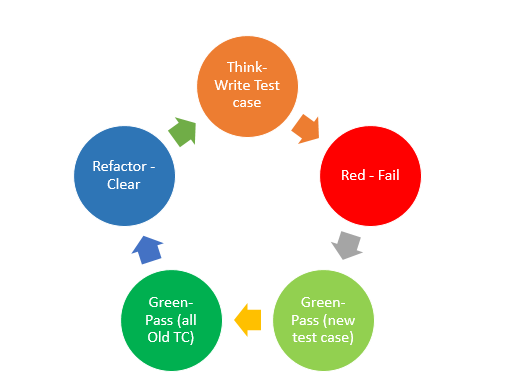

# n-queens-algorithm

## Built With

* [Javascript](https://www.javascript.com)
* [Chai](https://www.npmjs.com/package/chai)
* [Mocha](https://www.npmjs.com/package/mocha)

## What is n-queens?
The eight queens puzzle is the problem of placing eight chess queens on an 8×8 chessboard so that no two queens threaten each other; thus, a solution requires that no two queens share the same row, column, or diagonal.

Chess composer Max Bezzel published the eight queens puzzle in 1848. Franz Nauck published the first solutions in 1850. Nauck also extended the puzzle to the n queens problem, with n queens on a chessboard of n×n squares.

Since then, many mathematicians, including Carl Friedrich Gauss, have worked on both the eight queens puzzle and its generalized n-queens version. In 1874, S. Gunther proposed a method using determinants to find solutions. J.W.L. Glaisher refined Gunther's approach.

In 1972, Edsger Dijkstra used this problem to illustrate the power of what he called structured programming. He published a highly detailed description of a depth-first backtracking algorithm.

* [Queens algorithm](https://en.wikipedia.org/wiki/Eight_queens_puzzle)

## What is TDD?
Test-driven development (TDD) is a software development process that relies on the repetition of a very short development cycle: requirements are turned into very specific test cases, then the code is improved so that the tests pass. This is opposed to software development that allows code to be added that is not proven to meet requirements.

The following sequence is based on the book Test-Driven Development by Example:

1. Add a test
In test-driven development, each new feature begins with writing a test. Write a test that defines a function or improvements of a function, which should be very succinct.

2. Run all tests and see if the new test fails
This validates that the test harness is working correctly, shows that the new test does not pass without requiring new code because the required behavior already exists, and it rules out the possibility that the new test is flawed and will always pass. The new test should fail for the expected reason.

3. Write the code
The next step is to write some code that causes the test to pass. 

4. Run tests
If all test cases now pass, the programmer can be confident that the new code meets the test requirements, and does not break or degrade any existing features. If they do not, the new code must be adjusted until they do.

5. Refactor code
The growing code base must be cleaned up regularly during test-driven development. New code can be moved from where it was convenient for passing a test to where it more logically belongs. Duplication must be removed. Object, class, module, variable and method names should clearly represent their current purpose and use, as extra functionality is added.

Repeat
Starting with another new test, the cycle is then repeated to push forward the functionality.

* [Test-driven development](https://en.wikipedia.org/wiki/Test-driven_development)

## Author

* **danisan9490**
